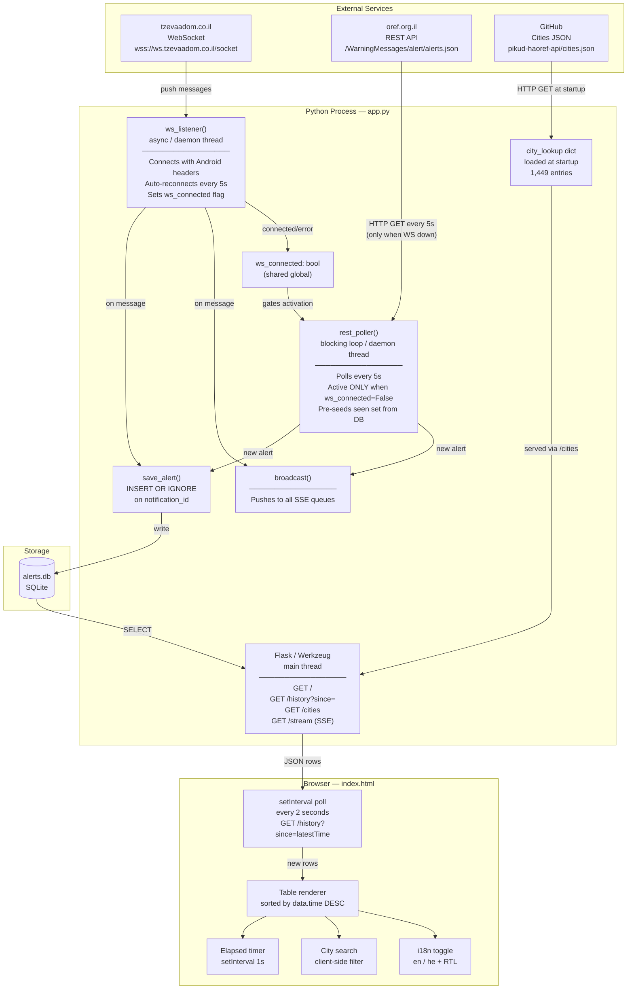
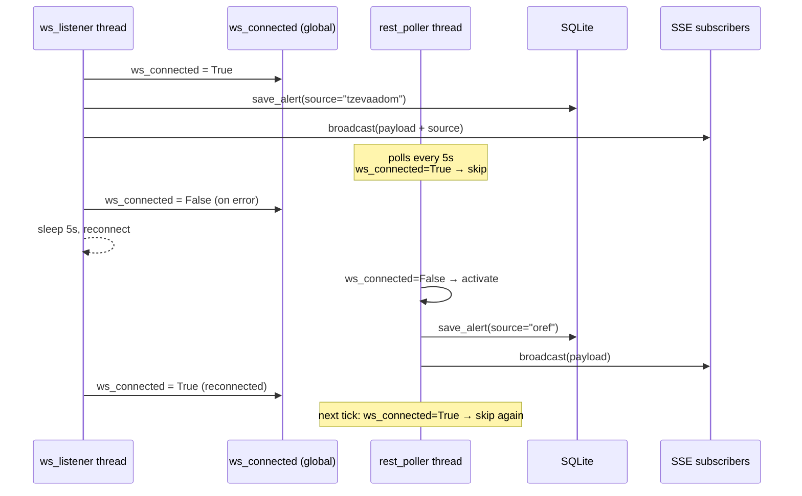

# System Diagram

## Component Architecture



## Thread Interaction



## Deduplication Logic

```
Inbound alert
      │
      ▼
notification_id already in DB?
      │ YES → discard (INSERT OR IGNORE)
      │ NO  → insert + broadcast
      ▼
Is source=oref AND ws_connected=True?
      → This path is unreachable by design (REST is gated)
```
