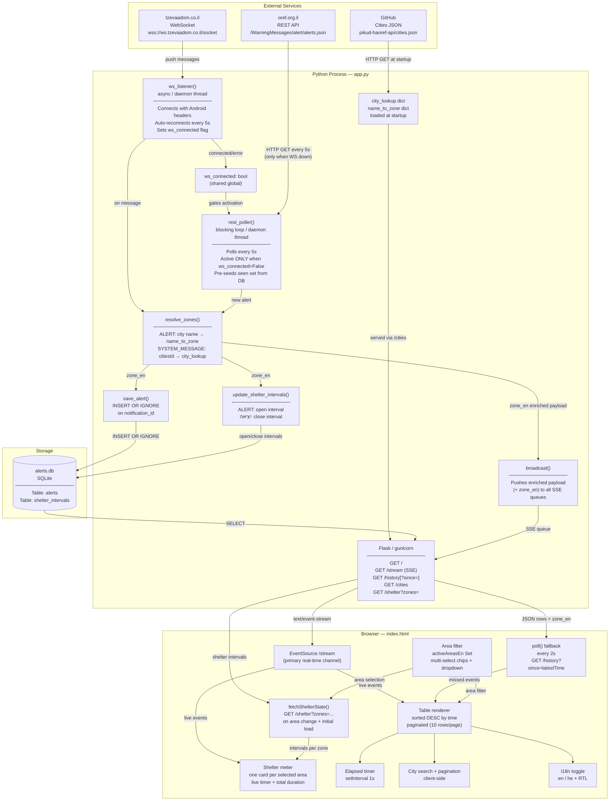

# System Diagram

## Component Architecture



---

## Thread Interaction

```mermaid
sequenceDiagram
    participant WS as ws_listener thread
    participant FLAG as ws_connected (global)
    participant REST as rest_poller thread
    participant RZ as resolve_zones()
    participant DB as SQLite
    participant SSE as SSE subscribers

    WS->>FLAG: ws_connected = True
    WS->>RZ: resolve_zones(type, data)
    RZ-->>WS: zone_en string
    WS->>DB: save_alert() + update_shelter_intervals()
    WS->>SSE: broadcast(payload + zone_en)

    Note over REST: polls every 5s; ws_connected=True → skip

    WS->>FLAG: ws_connected = False (on error)
    WS-->>WS: sleep 5s, reconnect

    REST->>REST: ws_connected=False → activate
    REST->>RZ: resolve_zones("ALERT", item)
    REST->>DB: save_alert() + update_shelter_intervals()
    REST->>SSE: broadcast(payload + zone_en)

    WS->>FLAG: ws_connected = True (reconnected)
    Note over REST: next tick: ws_connected=True → skip again
```

---

## Startup Sequence

```
Process start
  │
  ├─► init_db()                  — create tables; ALTER TABLE for missing columns
  ├─► load_cities()              — fetch GitHub JSON → city_lookup, name_to_zone
  ├─► backfill_zone_en()         — resolve zone_en for pre-existing rows (migration)
  ├─► rebuild_shelter_intervals() — DELETE + replay all alerts → consistent shelter state
  ├─► Thread: run_ws()            — start WebSocket listener
  └─► Thread: rest_poller()       — start REST backup poller
```

---

## Deduplication

```
Inbound alert
      │
      ▼
  notification_id in DB?
      YES → INSERT OR IGNORE (no-op)
      NO  → save + update shelter + broadcast

Browser:
  receivedIds Set (in-memory)
  Each addRow() call checks and skips duplicate notificationIds
  (guards against SSE + poll delivering same event twice)
```
